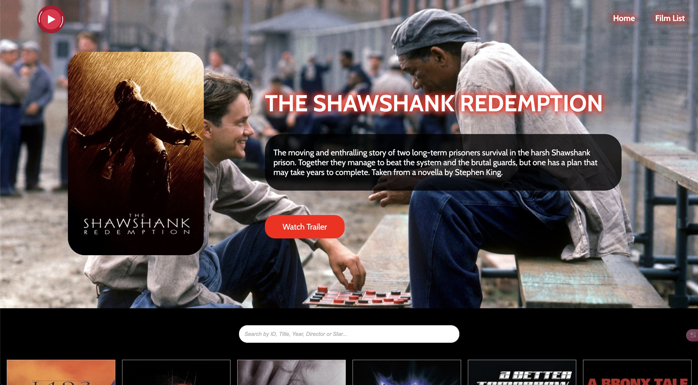
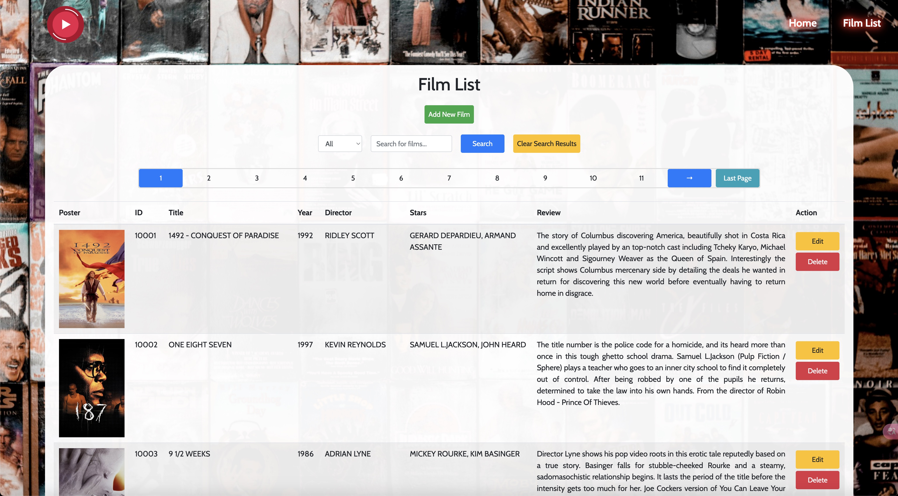

# [FilmMVC (HTTP/MVC Web Application)](https://suatkocar.dev/FilmMVC/)

## Home Page



## Film List Page



## Project Overview
FilmMVC is a film management system developed using Java Servlets and JSP. The application allows users to perform CRUD operations on a film database and integrates with external APIs for additional film information.

## Features
- **CRUD Operations:** Users can add, edit, delete, and list films.
- **Search Functionality:** The application provides search capabilities for films by various criteria.
- **External API Integration:** It integrates with external APIs to fetch additional film information.

## Technologies Used
- **Backend:** Java, Servlets, JSP
- **Database:** MySQL
- **Build Tool:** Apache Maven
- **IDE:** Eclipse

## Design and Architecture

The FilmMVC project follows a Model-View-Controller (MVC) design pattern.
1. **Model:** Represents the film data and business logic.
2. **View:** Displays the data (film information) to the user.
3. **Controller:** Handles user input and interacts with the model to update the view.

## Getting Started

### Prerequisites
- Java Development Kit (JDK) 8 or later
- Apache Maven
- MySQL Server

### Installation

1. Clone the repository:

   ```bash
   git clone https://github.com/suatkocar/FilmMVC.git
   ```

2. Navigate to the project directory:

   ```bash
   cd FilmMVC
   ```

3. Set up the database:
   
- Create a MySQL database named filmdb.
- Execute the SQL script located at `src/main/resources/createfilms.sql` to create the necessary tables.

4. Create and configure the config.properties file:

- Copy the example config file:

   ```bash
   cp src/main/resources/config.properties.example src/main/resources/config.properties
   ```

- Edit the config.properties file and set your database and API credentials:

   ```properties
   jdbcUrl=jdbc:mysql://localhost:3306/filmdb
   jdbcUser=your-username
   jdbcPassword=your-password
   TmdbApiKey=your-api-key
   ```

5. Build the project:

   ```bash
   mvn clean install
   ```

6. Deploy the `FilmMVC.war` file created in target folder to your servlet container (e.g., Apache Tomcat).

## Usage

Access the application at `http://localhost:8080/FilmMVC`.

## Project Structure

   ```plaintext
   FilmMVC
   ├── build
   ├── deploy
   ├── src
   │   ├── main
   │   │   ├── java
   │   │   │   ├── controller
   │   │   │   ├── dao
   │   │   │   ├── listener
   │   │   │   └── model
   │   │   ├── resources
   │   │   └── webapp
   │   │       ├── META-INF
   │   │       ├── WEB-INF
   │   │       ├── audio
   │   │       ├── css
   │   │       ├── images
   │   │       ├── js
   │   │       └── json
   └── README.md
   ```

## License

This project is licensed under the MIT License - see the [LICENSE.md](LICENSE.md) file for details.

## Contact

For any inquiries, please contact me at suatkocar.dev@gmail.com.
